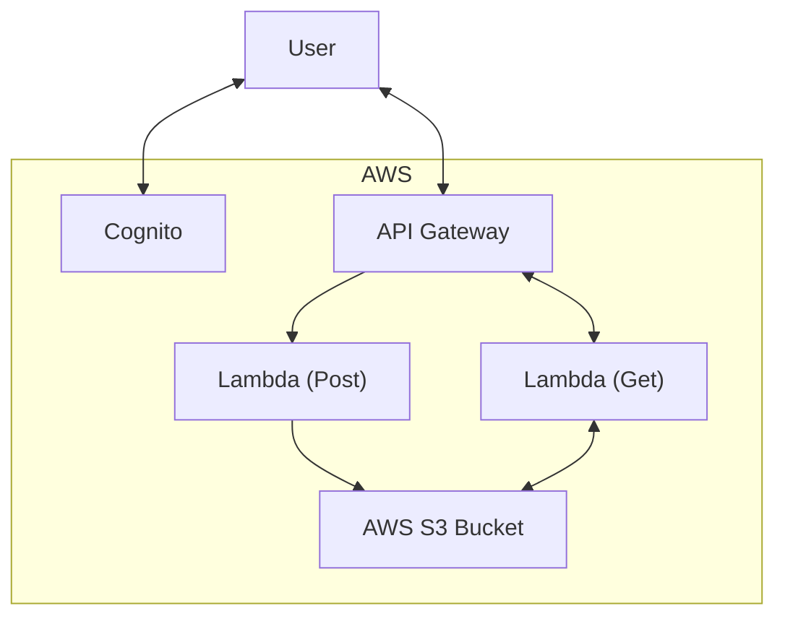

# Image Processor

## Overview

This project contains an image uploading and downloading service built using AWS Lambda, S3, Api Gateway, and Cognito, provisioned using TF. It has the following features:

- [x] Allow authenticated users to upload image files. Validate the files are only images.
- [x] Allow authenticated users to download a 1280x720 sized and 180 degrees rotated version of the image.
- [x] Allow authenticated users to download the original image.
- [ ] Allow authenticated users to see a log of the uploaded images with the status of processing, any failure details, and which user uploaded it.
- [ ] Allow external systems to download the modified image on request. The external systems will provide a fixed token to access the API.

Authentication is complete and working, but so far has not been merged to 'main' as a solution is still in progress in terms of a static authorization header for tests. This code is in a pull request, and so the current code in main does not have any authentication.

## Implementation Steps

I developed this project incrementally, with a focus on a working demonstrable solution at each commit. This meant I built the solution as follows:

1. Add functionality to store images in S3 via Lambda.
2. Add functionality to retrieve an image from S3 via Lambda.
3. Add functionality to resize and rotate the image.
4. Add an API Gateway to consolidate routing and provide a platform for introducing Cognito and caching in later commits.
5. Add user authentication to POST and GET routes.

Later commits will include the other two requirements, caching and further testing. In future, I would also like to use cdktf for writing terraform config in code, and terratest for end to end testing, two libraries that I have been interested in using for a while but havent yet had the opportunity to use.

## Folder structure

```
.
├── infra
│   ├── lambdas
│   │    ├── image_get
│   │    │   └── image_get_lambda
│   │    ├── image_put
│   │    │   └── image_put_lambda
│   │    └── shared
|   └── main.tf
└── tests
    └── end2end_test.go
```

## Basic Architecture overview


